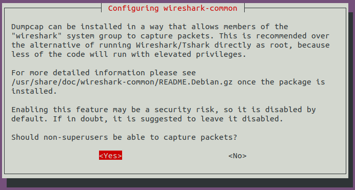

# Environment Setup

If you see here then you must be a high-end player, the instructions here will be very simple.

## Install Switchyard

You can find instructions [here](https://github.com/jsommers/switchyard), the repository of switchyard on GitHub. A quick note here for Ubuntu.

```
git clone https://github.com/jsommers/switchyard.git
sudo apt-get install libffi-dev libpcap-dev python3-dev python3-pip
```

You can install Switchyard and the necessary related packages in an isolated Python virtual environment ("venv"), which is the recommended path, or in the system directories, which is often less desirable. The venv route is highly suggested, since it makes all installation "local" and can easily destroyed, cleaned up, and recreated.

To create a new virtual environment, you could do something like the following under your workspace folder

```
python3 -m venv syenv
```

You can change the name `syenv` to whatever you'd like to name your virtual environment. Next, you need to activate the environment. The instructions vary depending on the shell you're using. On `bash`, the command is

```
source ./syenv/bin/activate
```

You'll need to replace `syenv` with whatever you named the virtual environment. If you're using a different shell than bash, refer to Python documentation on the venv module.

Finally, install Switchyard. All the required additional libraries should be automatically installed, too.

```
python3 -m pip install switchyard
```

Then I suggest to exclude your virtual environment out of git tracking. Add this line in `.gitignore`

```
syenv/
```

## Install Mininet

```
sudo apt-get install mininet
```

Or you want to build mininet yourself. The installation guide is [here](http://mininet.org/download/).

## Install Wireshark

```
sudo add-apt-repository ppa:wireshark-dev/stable
sudo apt-get update
sudo apt-get install wireshark
```

You need to configure wireshark during installation. For non-superusers capturing packets, choose *Yes* here.



Then add your user to `wireshark` user group to allow you capturing packets.

```
sudo usermod -a -G wireshark $USER
```

## Other Softwares

You also want to install some editors like Vim, Emacs, Visual Studio Code, Sublime and so on. But we do not install any one of them to avoiding a quarrel about the best editor. Chose your favorite one and install it yourself.

Another helpful module VBoxGusetAdditions is not installed because various virtual machine hypervisors you will use.
