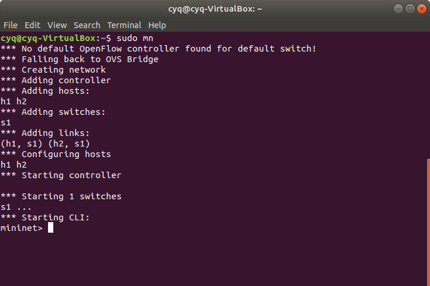
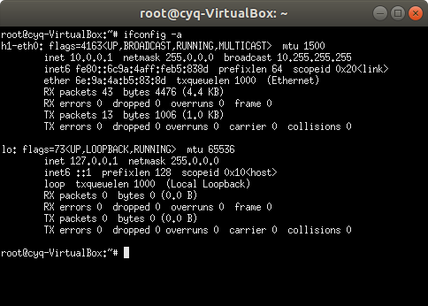

# How to use Mininet

We expect that you have read the [Mininet Walkthrough](http://mininet.org/walkthrough/) at least. Then here is a minimum walkthrough you should do.

## Everyday Mininet Usage

First, a (perhaps obvious) note on command syntax for this walkthrough:

- `$` proceeds Linux commands that should be typed at the shell prompt
- `mininet>` proceeds Mininet commands that should be typed at Mininet’s CLI,
- `#` proceeds Linux commands that are typed at a root shell prompt

We will show the differences later.

### Start Mininet

So let's start with Mininet startup options. Type the following command to display a help message. Read the output for more usages of Mininet.

```
$ sudo mn -h
```

> [!WARNING|style:flat]
> Commands start with `sudo` or run as a superuser (prompt like `#`) are dangerous. Avoid doing things like that. But you need run Mininet as a superuser so be careful.

Then let's build a Mininet default topology.

```
$ sudo mn
```



You will see the same output as the picture above. See what Mininet tells us. The default topology contains two hosts and one switch. They link like this

```
h1 --- s1 --- h2
```

And you now are in Mininet CLI starts with `mininet>`. The next thing is to interact with Hosts. Keep this open and let's go to the next subsection.

### Interact with Hosts

First let's see what we can do in Mininet CLI.

```
mininet> help
```

Display nodes.

```
mininet > nodes
```

Display links.

```
mininet> net
```

Dump information about all nodes. This command is useful.

```
mininet> dump
```

You should see the switch and two hosts listed.

If the first string typed into the Mininet CLI is a host, switch or controller name, the command is executed on that node. Run a command on a host process.

```
mininet> h1 ifconfig -a
```

And you can start a pop-up terminal emulator in one host.

```
mininet> h1 xterm
```

The new window pops up here is the terminal emulator of `h1`. If you type `ifconfig -a` here, the output is totally the same as you type `h1 ifconfig -a` in Mininet CLI.



### Test Connectivity Between Hosts

Now, verify that you can ping from host 0 to host 1. You can also do it in pop-up xterm at `h1`.

```
mininet> h1 ping -c 1 h2
```

An easier way to run this test is to use the Mininet CLI built-in `pingall` command, which does an all-pairs `ping`.

```
mininet> pingall
```

### Run A Simple Web Server and Client

Remember that `ping` isn’t the only command you can run on a host! Mininet hosts can run any command or application that is available to the underlying Linux system (or VM) and its file system. You can also enter any `bash` command, including job control (`&`, `jobs`, `kill`, etc..)

Next, try starting a simple HTTP server on h1, making a request from h2, then shutting down the web server.

```
mininet> h1 python -m SimpleHTTPServer 80 &
mininet> h2 wget -O - h1
...
mininet> h1 kill %python
```

Exit the CLI.

```
mininet> exit
```

### Cleanup

If Mininet crashes for some reason, clean it up.

```
$ sudo mn -c
```

## Custom Topologies

Custom topologies can be easily defined as well, using a simple Python API. The example here connects 4 devices as a star topology shows below. This file is in the Switchyard repository [`examples/start_mininet.py`](https://github.com/shellqiqi/switchyard/blob/master/examples/start_mininet.py).

```py
#!/usr/bin/python

import sys

from mininet.topo import Topo
from mininet.net import Mininet
from mininet.log import lg
from mininet.node import CPULimitedHost
from mininet.link import TCLink
from mininet.util import irange, custom, quietRun, dumpNetConnections
from mininet.cli import CLI

from time import sleep, time
from subprocess import Popen, PIPE
import subprocess
import argparse
import os

parser = argparse.ArgumentParser(description="Mininet pyswitch topology")
# no arguments needed as yet :-)
args = parser.parse_args()
lg.setLogLevel('info')

class PySwitchTopo(Topo):

    def __init__(self, args):
        # Add default members to class.
        super(PySwitchTopo, self).__init__()

        # Host and link configuration
        #
        #
        #   server1 
        #          \
        #           hub----client
        #          /
        #   server2 
        #

        nodeconfig = {'cpu':-1}
        self.addHost('server1', **nodeconfig)
        self.addHost('server2', **nodeconfig)
        self.addHost('hub', **nodeconfig)
        self.addHost('client', **nodeconfig)
        
        for node in ['server1','server2','client']:
            # all links are 10Mb/s, 100 millisecond prop delay
            self.addLink(node, 'hub', bw=10, delay='100ms')

def set_ip(net, node1, node2, ip):
    node1 = net.get(node1)
    ilist = node1.connectionsTo(net.get(node2)) # returns list of tuples
    intf = ilist[0]
    intf[0].setIP(ip)

def reset_macs(net, node, macbase):
    ifnum = 1
    node_object = net.get(node)
    for intf in node_object.intfList():
        node_object.setMAC(macbase.format(ifnum), intf)
        ifnum += 1

    for intf in node_object.intfList():
        print node,intf,node_object.MAC(intf)

def set_route(net, fromnode, prefix, nextnode):
    node_object = net.get(fromnode)
    ilist = node_object.connectionsTo(net.get(nextnode))
    node_object.setDefaultRoute(ilist[0][0])

def setup_addressing(net):
    reset_macs(net, 'server1', '10:00:00:00:00:{:02x}')
    reset_macs(net, 'server2', '20:00:00:00:00:{:02x}')
    reset_macs(net, 'client', '30:00:00:00:00:{:02x}')
    reset_macs(net, 'hub', '40:00:00:00:00:{:02x}')
    set_ip(net, 'server1','hub','192.168.100.1/24')
    set_ip(net, 'server2','hub','192.168.100.2/24')
    set_ip(net, 'client','hub','192.168.100.3/24')

def disable_ipv6(net):
    for v in net.values():
        v.cmdPrint('sysctl -w net.ipv6.conf.all.disable_ipv6=1')
        v.cmdPrint('sysctl -w net.ipv6.conf.default.disable_ipv6=1')

def main():
    topo = PySwitchTopo(args)
    net = Mininet(controller=None, topo=topo, link=TCLink, cleanup=True)
    setup_addressing(net)
    disable_ipv6(net)
    net.interact()

if __name__ == '__main__':
    main()
```

In general, you don't need to modify the topology file we provide. But if you do, you need the document *[Introduction to Mininet](https://github.com/mininet/mininet/wiki/Introduction-to-Mininet)* which gives you the Mininet Python API.

Please read it carefully. Then let's start this topology.

```
$ sudo python examples/start_mininet.py
```

In this topology, hosts can not `ping` each other because the device named `hub` has no routing rules configured, so exit here. In the section of Switchyard, we will make it work.

> [!NOTE]
> Mininet topology scripts are written in Python 2.
