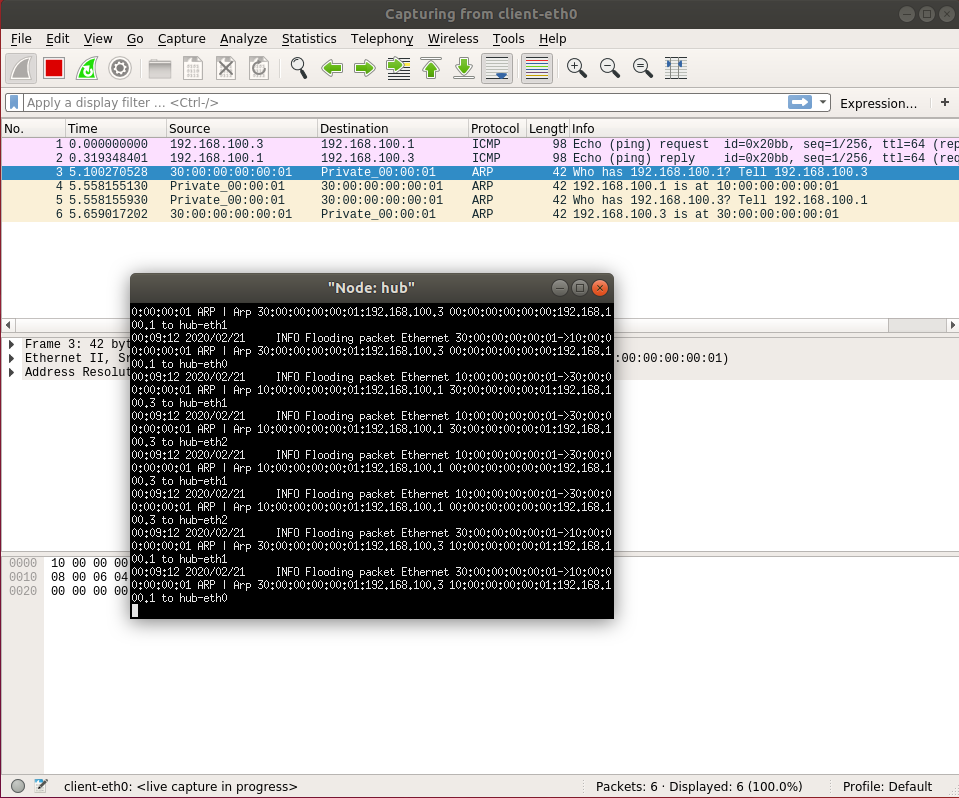

# How to program in Switchyard

We expect that you have complete [How to use Mininet](./mininet.md) and [How to use Wireshark](./wireshark.md). Next is the most important section that tells how to program in Switchyard. We will show you a hub, just forward any input packets to any other interfaces. There are three files for this section.

- [`examples/start_mininet.py`](https://github.com/shellqiqi/switchyard/blob/master/examples/start_mininet.py)
- [`examples/myhub.py`](https://github.com/shellqiqi/switchyard/blob/master/examples/myhub.py)
- [`examples/hubtests.py`](https://github.com/shellqiqi/switchyard/blob/master/examples/hubtests.py)

The [Switchyard documentation](https://jsommers.github.io/switchyard/) also uses these files to show many useful APIs. Again, it is very important to read it. In this section we do not show you the APIs but the workflow and a little code explanation.

## Prepare Your Test Script

You need to construct test script yourself. But we have some template test scripts help you. Here is the test script for our hub.

```py
#!/usr/bin/env python3

from switchyard.lib.userlib import *

def mk_pkt(hwsrc, hwdst, ipsrc, ipdst, reply=False):
    ether = Ethernet(src=hwsrc, dst=hwdst, ethertype=EtherType.IP)
    ippkt = IPv4(src=ipsrc, dst=ipdst, protocol=IPProtocol.ICMP, ttl=32)
    icmppkt = ICMP()
    if reply:
        icmppkt.icmptype = ICMPType.EchoReply
    else:
        icmppkt.icmptype = ICMPType.EchoRequest
    return ether + ippkt + icmppkt

def hub_tests():
    s = TestScenario("hub tests")
    s.add_interface('eth0', '10:00:00:00:00:01')
    s.add_interface('eth1', '10:00:00:00:00:02')
    s.add_interface('eth2', '10:00:00:00:00:03')

    # test case 1: a frame with broadcast destination should get sent out
    # all ports except ingress
    testpkt = mk_pkt("30:00:00:00:00:02", "ff:ff:ff:ff:ff:ff", "172.16.42.2", "255.255.255.255")
    s.expect(PacketInputEvent("eth1", testpkt, display=Ethernet), "An Ethernet frame with a broadcast destination address should arrive on eth1")
    s.expect(PacketOutputEvent("eth0", testpkt, "eth2", testpkt, display=Ethernet), "The Ethernet frame with a broadcast destination address should be forwarded out ports eth0 and eth2")

    # test case 2: a frame with any unicast address except one assigned to hub
    # interface should be sent out all ports except ingress
    reqpkt = mk_pkt("20:00:00:00:00:01", "30:00:00:00:00:02", '192.168.1.100','172.16.42.2')
    s.expect(PacketInputEvent("eth0", reqpkt, display=Ethernet), "An Ethernet frame from 20:00:00:00:00:01 to 30:00:00:00:00:02 should arrive on eth0")
    s.expect(PacketOutputEvent("eth1", reqpkt, "eth2", reqpkt, display=Ethernet), "Ethernet frame destined for 30:00:00:00:00:02 should be flooded out eth1 and eth2") 

    resppkt = mk_pkt("30:00:00:00:00:02", "20:00:00:00:00:01", '172.16.42.2', '192.168.1.100', reply=True)
    s.expect(PacketInputEvent("eth1", resppkt, display=Ethernet), "An Ethernet frame from 30:00:00:00:00:02 to 20:00:00:00:00:01 should arrive on eth1")
    s.expect(PacketOutputEvent("eth0", resppkt, "eth2", resppkt, display=Ethernet), "Ethernet frame destined to 20:00:00:00:00:01 should be flooded out eth0 and eth2")

    # test case 3: a frame with dest address of one of the interfaces should
    # result in nothing happening
    reqpkt = mk_pkt("20:00:00:00:00:01", "10:00:00:00:00:03", '192.168.1.100','172.16.42.2')
    s.expect(PacketInputEvent("eth2", reqpkt, display=Ethernet), "An Ethernet frame should arrive on eth2 with destination address the same as eth2's MAC address")
    s.expect(PacketInputTimeoutEvent(1.0), "The hub should not do anything in response to a frame arriving with a destination address referring to the hub itself.")
    return s

scenario = hub_tests()
```

The var `scenario` is very important in the test framework of Switchyard, do not forget it. Then you need to construct your events happend on your hub like packets in and out on which interface. All test APIs used is introduced [here](https://jsommers.github.io/switchyard/test_scenario_creation.html).

## Implement your device

Then you need to implement your device. Generally, your initial test files and device logic are not complete. You need to modify them step by step. This programming mode is called Test Driven Development (TDD). Here is our hub code.

```py
#!/usr/bin/env python3

'''
Ethernet hub in Switchyard.
'''
from switchyard.lib.userlib import *

def main(net):
    my_interfaces = net.interfaces() 
    mymacs = [intf.ethaddr for intf in my_interfaces]

    while True:
        try:
            timestamp,dev,packet = net.recv_packet()
        except NoPackets:
            continue
        except Shutdown:
            return

        log_debug ("In {} received packet {} on {}".format(net.name, packet, dev))
        eth = packet.get_header(Ethernet)
        if eth is None:
            log_info("Received a non-Ethernet packet?!")
            continue

        if eth.dst in mymacs:
            log_info ("Received a packet intended for me")
        else:
            for intf in my_interfaces:
                if dev != intf.name:
                    log_info ("Flooding packet {} to {}".format(packet, intf.name))
                    net.send_packet(intf, packet)
    net.shutdown()
```

In Switchyard, the device you want to be the hub will run this script and act like a hub by receiving any packets and forwarding to any other interfaces except the packets towards the hub itself. The APIs used in this file is introduced [here](https://jsommers.github.io/switchyard/writing_a_program.html).

## Runing in the Test Environment

> [!NOTE|style:flat]
> You need to activate your Python virtual environment first in any case you want to run Switchyard. This step is very important. In the root dictionary of Switchyard, run
> ```
> $ source ./syenv/bin/activate
> ```

You can test your hub code with your test file in Switchyard test mode. At minimum you would invoke `swyard` as follows.

```
$ swyard -t examples/hubtests.py examples/myhub.py
```

Note that the `-t` option puts swyard in test mode. The argument to the `-t` option should be the name of the test scenario to be executed, and the final argument is the name of your code.

After that, you will get some output shows if your tests pass or fail.

More about test environment and some debug methods are introduced [here](https://jsommers.github.io/switchyard/test_execution.html).

## Running in the Mininet

First let's start our topology we provided at `examples/start_mininet.py`.

```
$ sudo python examples/start_mininet.py
```

Then run your hub code to the device you what. Here must be the root of our star shape topology named `hub`. It is better to open xterm on it so you can see the output of it.

```
mininet> xterm hub
```

Then run your hub code on it. Remember activate your Python virtual environment first.

```
# source ./syenv/bin/activate
# swyard examples/myhub.py
... here is your hub logs ...
```

Now you have your topology ready and your hub running, let's see if it works. In Mininet CLI, type `pingall` and return.

```
mininet> pingall
*** Ping: testing ping reachability
client -> X server1 server2 
hub -> X X X 
server1 -> client X server2 
server2 -> client X server1 
*** Results: 50% dropped (6/12 received)
```

This is the output what you will see.

You are able to capture in Mininet too. In any host you want to capture packets, run wireshark on it. In our case, we run wireshark on the host named `client`. Then we ping `client` to `server1`.

```
mininet> client wireshark &
mininet> client ping -c1 server1
```


