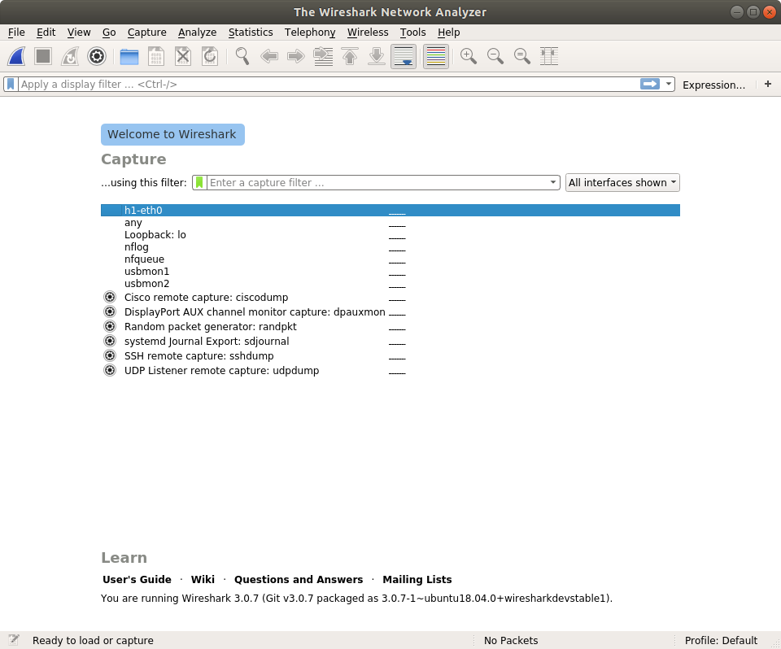
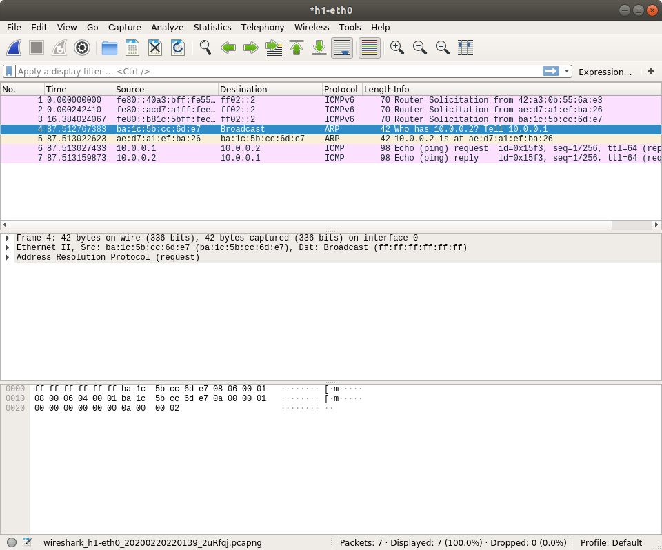
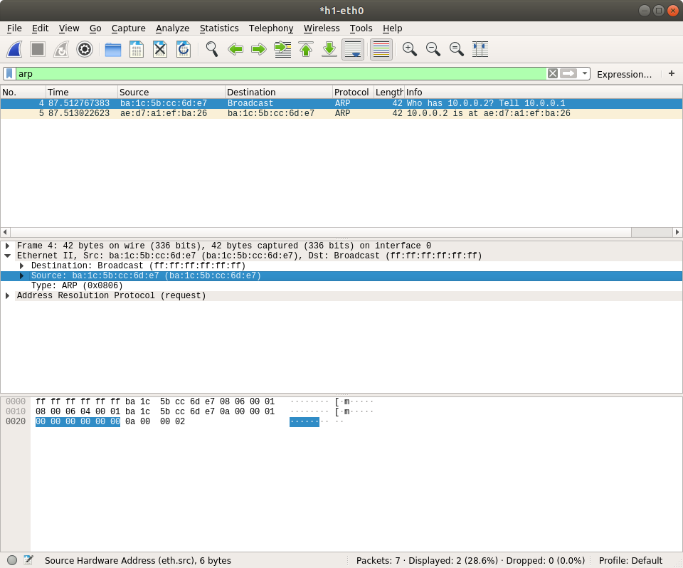

# How to use Wireshark

We expect that you have complete [How to use Mininet](./mininet.md). Then you will learn how to use Wireshark in it.

## Capturing Packets

First start the default Mininet topology.

```
$ sudo mn
```

Then open wireshark in `h1`.

```
mininet> h1 wireshark &
```



You need to choose which traffic you want to capture. Packets will send and receive on `h1-eth0` so you double click it.

It will be empty or some ICMPv6 packets be captured. Let's make some traffic ourselves.

```
mininet> h1 ping -c 1 h2
```



So here we have more packets captured. You may not know why these packets show up, but you will learnd in the next few lessons. Now let's filter some packets by typing protocol name on the filter text box.


You can also check the field in the packets like ethernet source MAC address. The value will be highlighted both in packet details and packet raw bytes.


