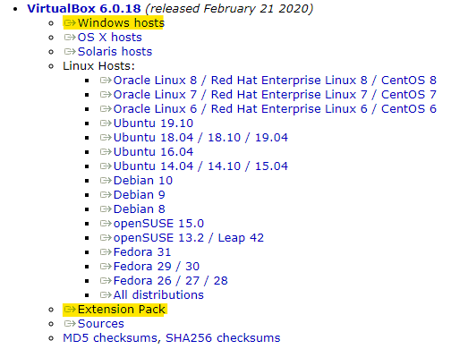

# Virtual Machine & Linux

The operating system of our experimental environment is Ubuntu 18.04 which is a free and open-source Linux distribution. In order to run Linux, you need to install a virtual machine hypervisor on your computer. There are two reasons.

1. Our experiments involve changes to the network. Using a virtual machine (VM) can avoid impact on your computer.
2. We will introduce Mininet and Switchyard later. It is much more easier to install and run them on Linux.

## Install VirtualBox

First download the VirtualBox installer, you can find it 
[here](https://www.virtualbox.org/wiki/Download_Old_Builds_6_0). You can choose the latest VirtualBox installer. If the operating system of your host is Windows, then click the download link `Windows hosts`. Another tool you need to download is `Extension Pack` which allows you resize your Linux display in VirtualBox. We highlight them in the picture below.

After completing download, install VirtualBox first then the extension pack.

## Import the VM Image

To ensure that your experimental environment is consistent, we provide a VM image. This image has Switchyard, Mininet and Wireshark installed so you do not need to worry about setting up the environment.

You can find the VM image [here](https://box.nju.edu.cn/d/123a70ac8ff34595b18f/).
- User name: `njucs`
- Password: `123`

You can learn about importing a VM image in VirtualBox [here](https://docs.oracle.com/cd/E36500_01/E36513/html/qs-import-vm.html).

## Install the VirtualBox Extension

Start your VM and check if your Linux runs well. You will find the display size is fixed to 800×600. To resize it you need to install the VirtualBox extension pack into your VM.

You can learn about installing the extension at [here](https://support.huaweicloud.com/bestpractice-ims/zh-cn_topic_0104740159.html).

## Use Linux

Most of our operations will be completed inside the terminal. You need to know

- Power on & off
- File system operations
- File and User permissions
- Run programs

A tutorial of Linux can be found at [鸟哥的 Linux 私房菜 —— 基础学习篇](http://cn.linux.vbird.org/linux_basic/linux_basic.php). Select the part you want to know and read it.

## Other

You are also free to use your favorite virtualization software for importing the image but you will most probably have to deal with the possible issues on yourself.

If you are a free soul and want to setup Switchyard in a different environment you are welcome to do that as well. You can find some useful information [here](../../appendix/environment-setup.md). This might or might not be useful for you depending on your environment.
