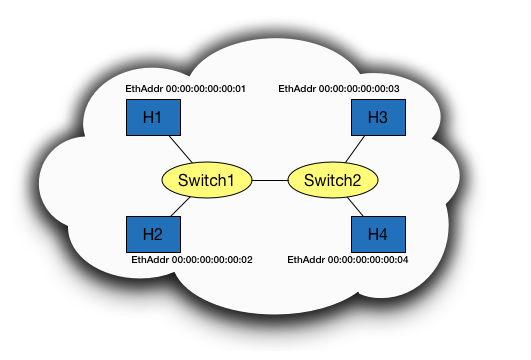
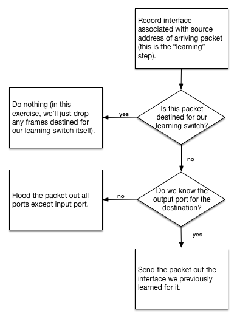

# Task 2: Basic Switch

## Ethernet Learning Switch Operation

An Ethernet learning switch is a device that has a set of interfaces ("ports") with links connected to other switches, and to end hosts. When Ethernet frames arrive on any port/interface, the switch sends the frame on an appropriate output port if the switch knows that the host is reachable through that port, or floods the frame out all ports if it does not know where the host is.

Consider the picture below. Say that Switch 1 doesn't know the locations of any host on the network, and that H1 wants to send an Ethernet frame to H3. When that frame arrives at Switch 1, it sees Ethernet source address `00:00:00:00:00:01` and destination address `00:00:00:00:00:03`. From this packet arrival, it knows that it can now reach H1 by send a frame out the same interface on which this frame has arrived. However, it does not know where to send to frame to reach H3, so it floods the packet out all ports except the one on which the frame arrived. Eventually, H3 will receive the frame. If it replies to H1, Switch 1 will receive a frame with the source address as H3's address, and the frame will arrive on the interface connected to Switch 2. At this point, Switch 1 now knows exactly which ports it needs to use to send frames to either H1 or H3.

The following flowchart summarizes the example described above. The only additional considerations shown in the flowchart are if the destination address is the same as one of the Ethernet addresses on the switch itself (i.e., the frame is intended for the switch), or the Ethernet destination address is the broadcast address `FF:FF:FF:FF:FF:FF`.

Your switch may have a table like:

| MAC Address       | Interface   |
| ----------------- | ----------- |
| ab:cd:ef:fe:cd:ba | interface-0 |
| ...               | ...         |

## Coding

Your task is to implement the logic in the above flowchart, using the Switchyard framework. The starter file is named `lab_2/myswitch.py`, which is the only file you'll need to modify.

Two links to Switchyard API documentation which you may find helpful are:

- Packet parsing/construction reference: https://shellqiqi.gitee.io/switchyard/reference.html#packet-parsing-and-construction-reference
- Ethernet packet header reference: https://shellqiqi.gitee.io/switchyard/reference.html#ethernet-header

Note that the documentation of Switchyard has examples on running Switchyard in test mode and in real mode, along with a walkthrough of creating a simple hub device, which is useful background material for this exercise.
