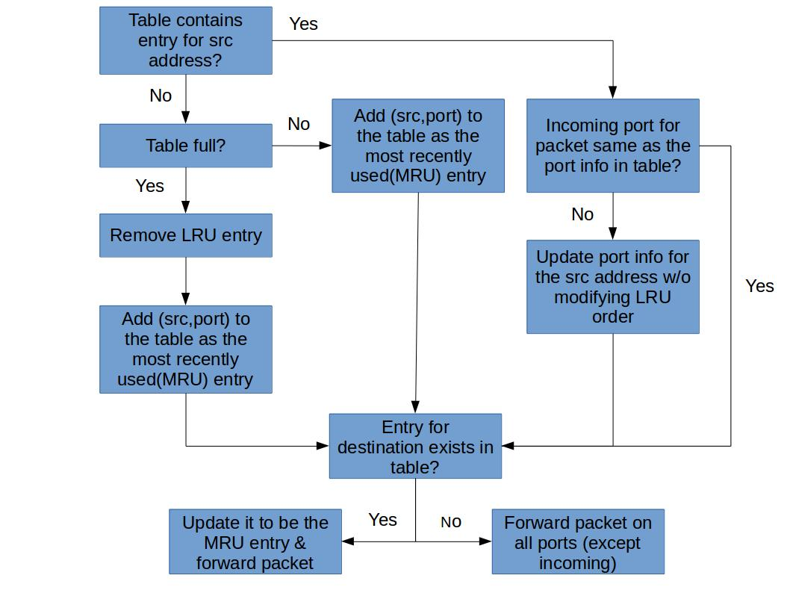

# Task 4: Least Recently Used

## Implementing Limited Storage for Rules Learned

Real learning switches also have limited storage for forwarding rules that are learned. Implement a feature by which your learning switch can only hold a limited number of rules (implement this flexibly so that you can easily change the maximum number of rules). When your switch needs to add a new rule but there is no more space, you can consider different policies for evicting an existing rule. This time we **evict the least recently used rule**.

General implementations of this technique require keeping "age bits" for rules and track the "Least Recently Used" rule based on age-bits. In such an implementation, every time a rule is used, the age of all other rules changes.

For this functionality assume that your table can only hold 2 entries at a time. If a new entry comes and your table is full, you will remove the entry that has not been matched with a Ethernet frame destination address for the longest time.

The following flowchart summarizes the algorithm described above.

Your switch may have a table like:

| MAC Address       | Interface   | Age |
| ----------------- | ----------- | --- |
| ab:cd:ef:fe:cd:ba | interface-0 | 2   |
| ...               | ...         | ... |

## Coding

Your task is to implement the logic in the above flowchart, using the Switchyard framework. You can start with copying the content of `lab_2/myswitch.py` to `lab_2/myswitch_lru.py`, which is the only file you'll need to modify.

## Testing

Test your switch with the test file `switchtests_lru.srpy` we provide.

✅ In the report, show the test result of your switch.  
(Optional) If you have written the test files yourself, show how you test the LRU algorithm.

## Deploying

Run your switch in Mininet.

✅ In Mininet, test the LRU algorithm. Prove that the LRU algorithm works with your testing procedure in the report.
