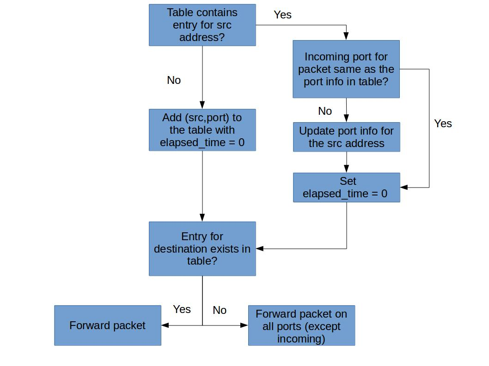

# Task 3: Timeouts

## Timeout Mechanism

Real learning switches remove forwarding table entries after some number of seconds have elapsed so that a learning switch can adapt to changes in network topology. Implement a timeout feature in your learning switch. Choose some reasonable value for a timeout (e.g., 10 seconds).

The following flowchart summarizes the algorithm described above.



Your switch may have a table like:

| MAC Address       | Interface   | Timestamp     |
| ----------------- | ----------- | ------------- |
| ab:cd:ef:fe:cd:ba | interface-0 | 123456.123456 |
| ...               | ...         | ...           |

## Coding

Your task is to implement the logic in the above flowchart, using the Switchyard framework. You can start with copying the content of `lab_2/myswitch.py` to `lab_2/myswitch_to.py`, which is the only file you'll need to modify.

## Testing

You should first develop your switch code using the Switchyard test framework. Assuming you have installed Switchyard in a Python virtual environment and have activated that venv, you should run:

```
(syenv) $ swyard -t lab_2/switchtests_to.srpy lab_2/myswitch_to.py
```

The above command it will execute a series of test cases against your program and display whether the tests pass or fail. The file `switchtests_to.srpy` is the test file we provide.

✅ In the report, show the test result of your switch. (Optional) If you have written the test files yourself, show how you test the timeout mechanism.

Once you get the tests to pass, you can try running your code in Mininet.

## Deploying

Run your switch in Mininet.

✅ In Mininet, test your timeout mechanism. Prove that the timeout mechanism works with your testing procedure in the report.
