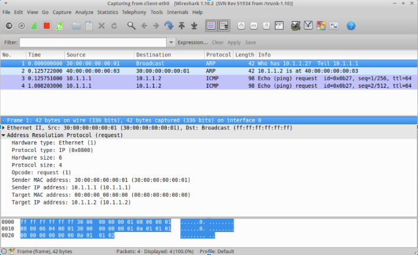
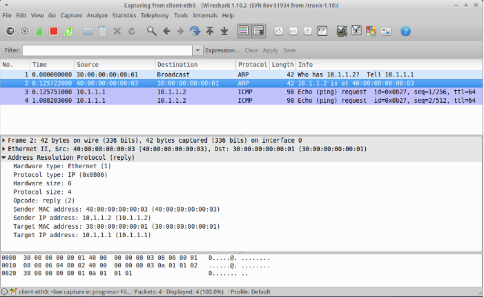

# Task 2: Handle ARP Request

## Procedure

Upon receiving a packet, determine whether it is an ARP request.

### Received ARP Requests

For ARP packet headers, there are two types of addresses, as well as source and destination values for each address type, giving a total of four addresses. For an ARP request, the source Ethernet and IP addresses are filled in, as well as the destination IP address. Note that the source and destination IP addresses are called `senderprotoaddr` and `targetprotoaddr` in the ARP header, respectively. The source and destination Ethernet addresses are called `senderhwaddr` and `targethwaddr`, respectively. The destination Ethernet address is *not* filled in: this is the address being requested.

Note that the packet header class for ARP is named `Arp`, so to obtain the ARP header from an incoming packet (if it exists) you can do something like:

```py
arp = packet.get_header(Arp)
```

See the [Arp packet header reference](https://shellqiqi.gitee.io/switchyard/reference.html#arp-address-resolution-protocol-header) in the Switchyard documentation for more.

For each ARP request, you should determine whether the `targetprotoaddr` field (IP address destination) in the ARP header is an IP address assigned to one of the interfaces on your router.

Remember that you can get a list of interfaces configured for the router by calling the `interfaces` method (or equivalently, the `ports` method) on the net object stored in the self.net attribute in the Router class. Note also that you can look up ports by Ethernet address, by name, or by IP address; refer to the documentation for the appropriate method.

If the destination IP address is one that is assigned to an interface of your Router, you should create and send an appropriate ARP reply. (If the destination IP address is not assigned to one of the router's interfaces, you should not respond with an ARP reply, even if you have enough information to do so.) The ARP reply should be sent out the same interface on which the ARP request arrived.

> [!TIP]
> The Switchyard documentation has details on what is returned by the `interfaces` method. You may wish to call this method in the constructor of the Router class and create some internal data structure for the Router, so it can keep track of its own interfaces.

### Received Other Packets

If a packet that you receive in the router is not an ARP request, you should ignore it (drop it) for now. In future exercises you'll handle more incoming packet types in your router.

## Coding

Your task is to implement the logic described above. The start file is named `lab_3/myrouter.py`.

The Switchyard documentation contains a section introducing how Packet parsing and construction works. This is strongly recommended background reading. You will also probably find the API reference to be helpful for packet parsing You may also make use of two helper functions (defined in `switchyard.lib.packet`, which is already imported in the template file).

- `create_ip_arp_reply(senderhwaddr, targethwaddr, senderprotoaddr, targetprotoaddr)`
- `create_ip_arp_request(senderhwaddr, senderprotoaddr, targetprotoaddr)`

Note that these two functions above return a full `Packet` object including `Ethernet` and `Arp` headers, all filled in.

## Testing

For initial testing and debugging of your code, you can run the Switchyard test scenario (routertests1.srpy). Run it like this:

<!-- TODO: Provide the test file and update here -->

```
$ swyard -t lab_3/routertests1.srpy myrouter.py
```

Read each individual test case output carefully (yes, it can be a lot to read!) since each test case has an explanation for what your code should be doing.

Note that the test scenario file is not included in this repository, but is available on the NJU Box.

✅ In the report, show the test result of your switch.  
(Optional) If you have written the test files yourself, show how you test the ARP works.

## Deploying

Once the Switchyard tests pass, you should test your router in Mininet. There is a `start_mininet.py` script available for building the following network topology:


> [!NOTE]
> Note that the above topology may **not** be the same as the one implied by the Switchyard tests.

To test your router in Mininet, you can do the following:

1. Open up a terminal on the virtual machine, and cd (if necessary) to the folder where your project files are located (or transfer them into the virtual machine). Then type the following to get Mininet started:

   ```
   $ sudo python lab_3/start_mininet.py
   ```

2. Open up an xterm on the client node:

   ```
   mininet> xterm client
   ```

3. Start up wireshark on the client. From the xterm running on the client, type:

   ```
   client# wireshark -k &
   ```

   > [!NOTE]
   > You'll get some warnings from Wireshark about running as root, which you can safely ignore.

4. Open an xterm on the router node:

   ```
   mininet> xterm router
   ```

5. Start your router in the Python virtual environment:

   ```
   (syenv) router# swyard lab_3/myrouter.py
   ```

6. Now, in the xterm running on the client, try to send an ICMP echo request to the IP address at the "other end" of the link between the client and the router.

   ```
   client# ping -c3 10.1.1.2
   ```

The router should initially receive an ARP request for its own IP address (which your router will need to correctly respond to!), then it should receive an ICMP echo request. Since your router isn't yet programmed to respond to ping requests, nothing else should happen (i.e., you'll get ping requests, but they won't be responded to).

In wireshark, you should see something similar to the following details when you click on the ARP request packet the first line in the capture window). Notice that the "target MAC address" is currently all zeroes, since this is the address being requested:



Also in wireshark, you should see the following details when you click on the ARP response packet (second line in the capture window). Notice that all the addresses in the ARP header are now filled in (and that source and destination addresses are effectively swapped):



So here is our example. Your task is: `ping` the router from another host (server1 or server2). Using Wireshark to prove that you have handled ARP requests well. ✅ Write the procedure and analysis in your report with screenshots.
